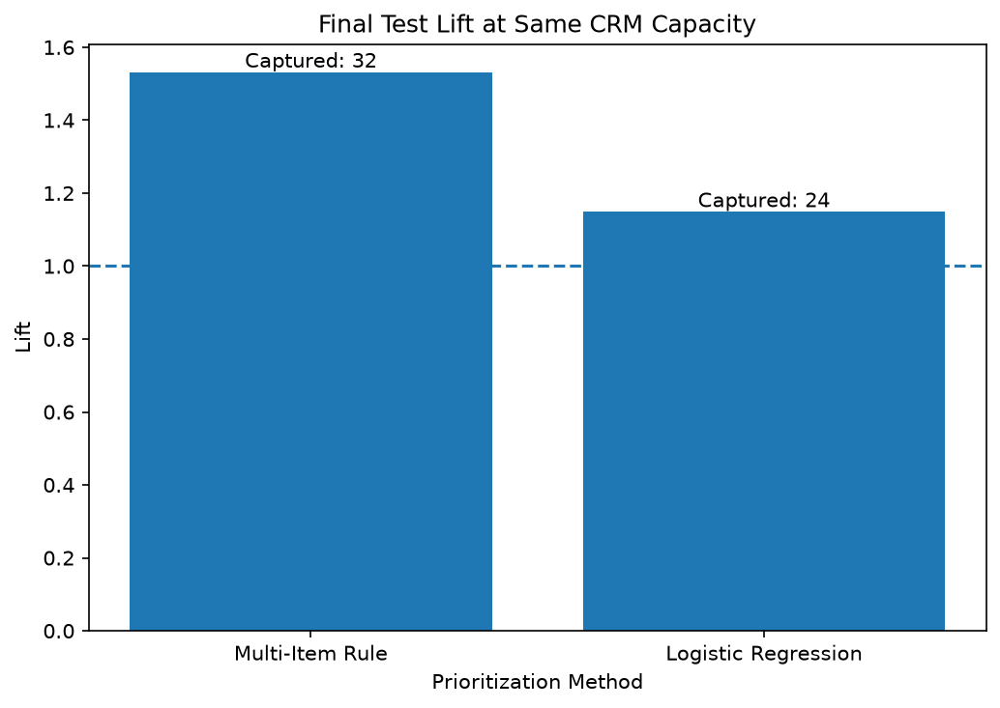

# Olist 90-Day Repeat Purchase Prediction

## 프로젝트 개요

이 프로젝트는 Olist 이커머스 데이터를 이용해 데이터셋에서 관측된 고객의 첫 구매 시점에 확인 가능한 정보만으로 향후 90일 이내 재구매 여부를 예측할 수 있는지 분석한다.

단순히 예측 정확도를 높이는 것이 목적이 아니라, 제한된 CRM 운영 자원 아래에서 머신러닝 기반 고객 우선순위가 단순 규칙 기반 방식보다 실제 재구매 고객을 더 효과적으로 선별할 수 있는지를 비교하는 것을 목표로 한다.

## 비즈니스 질문

첫 구매 시점까지 알 수 있는 정보만으로 향후 90일 이내 재구매 고객을 식별할 수 있는가?

그리고 머신러닝 기반 고객 우선순위는 단순 규칙 기반 우선순위보다 동일한 운영 용량에서 실제 재구매 고객을 더 효과적으로 포착할 수 있는가?

## 비즈니스 활용 시나리오

의사결정자:
CRM / Retention Manager

의사결정:
첫 구매 이후 유지 활동을 수행할 고객의 우선순위를 정한다.

예측 기준 시점:
고객의 첫 번째 payment-approved order가 확인된 시점
(`order_approved_at`)

## 데이터

Brazilian E-Commerce Public Dataset by Olist

원본 데이터는 저장소에 포함하지 않는다.

분석에서는 고객의 생애 전체 최초 구매가 아니라 Olist 데이터 관측 기간 내에서 확인되는 최초 구매를 사용한다.

## 프로젝트 범위

1. 데이터 구조 및 고객 식별자 검증
2. 유효 구매 이벤트 정의
3. 주문 단위 분석 테이블 구축
4. 고객별 최초 구매 Cohort 생성
5. 90일 재구매 Target 정의
6. Cohort 및 재구매 Timing 분석
7. 첫 구매 Feature 구축 및 탐색
8. 고객 Segment 통계 비교
9. Rule-based Baseline 구축
10. Logistic Regression 중심 예측 모델 구축
11. 동일 CRM 처리 용량에서 Rule과 ML 비교
12. Precision@K / Recall@K / Lift@K 기반 업무 가치 평가

## 현재 Primary Modeling Target

90일 전체 Outcome을 관찰할 수 있는 고객:

78,505명

Primary Modeling Target:

첫 승인 주문 후 1시간을 초과한 시점부터
90일 이내 추가 승인 주문 발생 여부

Primary Repeat Customers:

1,082명

Primary Repeat Rate:

1.38%

Reference Target:

첫 승인 주문 직후부터 90일까지의 기존 `repeat_90d`에서는 1,766명, 2.25%의 재구매율이 관측되었다.

Target Sensitivity 분석 결과, 초단기 주문이 Reference Target의 상당 부분을 차지함을 확인했고 CRM Retention 목적에 맞추기 위해 `repeat_90d_after_1h`을 Primary Modeling Target으로 확정했다.

Target이 매우 불균형하므로 Accuracy는 핵심 모델 평가 지표로 사용하지 않는다.

## 평가 기준

Primary Metrics:

- Precision@K
- Recall@K
- Lift@K

Secondary Metrics:

- PR-AUC
- Precision
- Recall
- F1

필요한 경우 확률 기반 운영을 위해 Calibration도 확인한다.

## 데이터 파이프라인

Raw Olist Data

→ Order-Level Analytical Base

→ Customer-Level First Approved Purchase

→ 90-Day Observation Eligibility

→ Repeat-Purchase Outcome

→ First-Purchase Feature Base

→ Statistical Validation

→ Rule-Based Baseline

→ Predictive Models

→ Top-K Business Comparison

## 주요 설계 원칙

모델 Feature는 첫 구매 예측 시점에 실제로 존재하는 정보만 사용한다.

미래 주문 수, 미래 매출, 배송 완료 결과, 리뷰, 90일 재구매 결과 등 예측 시점 이후 생성되는 정보는 모델 Feature에서 제외한다.

고객 분석 단위는 `customer_unique_id` 1명당 1행이다.

## Target 설계

초기 Reference Target에서는 첫 주문 후 1시간 이내의 추가 주문이 Positive Class의 상당 부분을 차지했다.

Sensitivity Analysis 결과 1시간 제외 시 재구매율은 2.25%에서 1.38%로 감소했지만, 1시간 기준과 24시간 기준의 차이는 0.08%p에 그쳤다.

이에 따라 1시간을 모델링용 경계로 확정했다.

이 경계는 모델 성능을 높이기 위해 선택한 것이 아니라 CRM Retention이라는 비즈니스 질문과 Target 의미를 정렬하기 위해 모델링 전에 결정했다.

## 주요 모델링 결과

Time-Based Validation을 사용해 Multi-Item Rule과 Logistic Regression을 비교하였다.


동일 CRM 처리 용량에서 Multi-Item Rule은 32명의 Repeat 고객을 포착했고, Final Logistic Regression은 24명을 포착하였다.

### Validation — Same CRM Capacity

- Multi-Item Rule: 43명 Repeat 포착
- Logistic Regression: 39명 포착

### Final Test — Same CRM Capacity

동일하게 1,466명의 고객을 선정했을 때:

- Multi-Item Rule: 32명 포착, Lift 1.53
- Final Logistic Regression: 24명 포착, Lift 1.15

Final Logistic Regression은 Top 5% 고객군에서는 Lift 1.88의 Ranking 신호를 보였지만, 약 10%의 동일 운영 용량에서는 단순 Multi-Item Rule을 넘어서지 못했다.

따라서 현재 First-Purchase Feature Set에서는 복잡한 모델 자체보다 해석 가능한 단순 Rule과 운영 용량 기준 평가가 더 효과적인 의사결정으로 이어졌다.

## 핵심 결과 요약

| 항목 | 결과 |
|---|---:|
| Modeling Population | 78,505 |
| Primary Repeat Rate | 1.38% |
| Final Test Population | 14,169 |
| Final Test Repeat Rate | 1.43% |
| Logistic PR-AUC | 0.0169 |
| Logistic ROC-AUC | 0.5264 |
| Logistic Top 5% Lift | 1.88 |
| Multi-Item Rule Lift @ Same Capacity | 1.53 |
| Logistic Lift @ Same Capacity | 1.15 |
| Rule Captured Repeat | 32 |
| Logistic Captured Repeat | 24 |

> **Project Summary:** [reports/project_summary.md](reports/project_summary.md)

## 상세 문서

- [Problem Statement](docs/problem_statement.md)
- [Analysis Findings](docs/analysis_findings.md)
- [Modeling Results](docs/modeling_results.md)
- [Decision Log](docs/decision_log.md)
- [Feature Dictionary](docs/feature_dictionary.md)
- [Data Dictionary](docs/data_dictionary.md)
- [Leakage Policy](docs/leakage_policy.md)

## 한계

- 데이터에서 최초로 관측된 구매가 고객 생애 전체의 최초 구매임을 보장하지 않는다.
- 예측 가능성과 인과관계는 구분한다.
- 높은 재구매 확률이 CRM 캠페인의 실제 증분 효과를 의미하지 않는다.
- 캠페인의 인과적 효과를 평가하려면 별도의 실험 설계가 필요하다.

## Reproducibility

원본 Olist 데이터는 저장소에 포함하지 않는다.

다음 CSV 파일을 `data/raw/`에 배치한다.

- `olist_customers_dataset.csv`
- `olist_orders_dataset.csv`
- `olist_order_items_dataset.csv`
- `olist_order_payments_dataset.csv`
- `olist_products_dataset.csv`
- `product_category_name_translation.csv`

환경 설치:

```bash
pip install -r requirements.txt