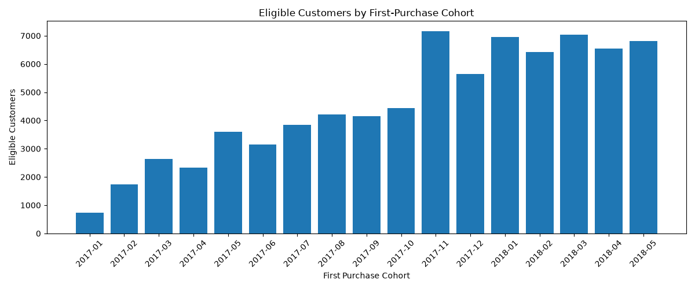
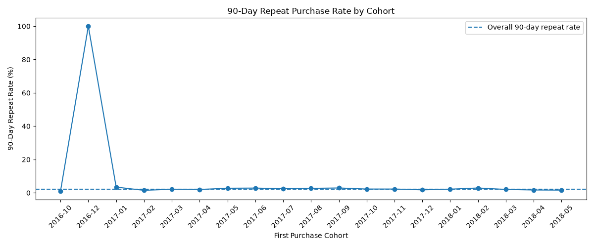
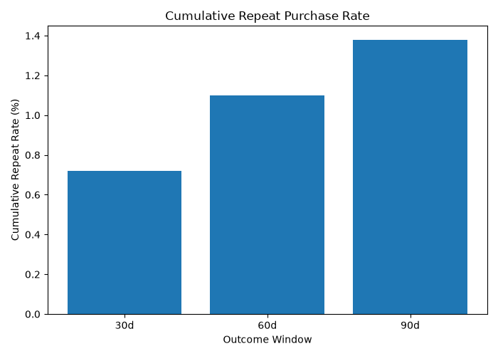
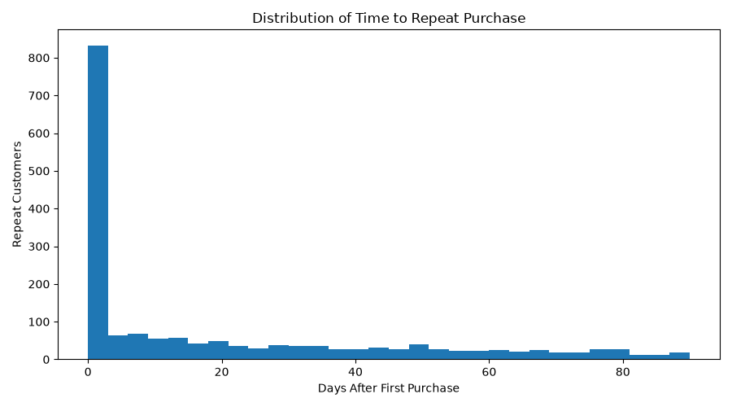
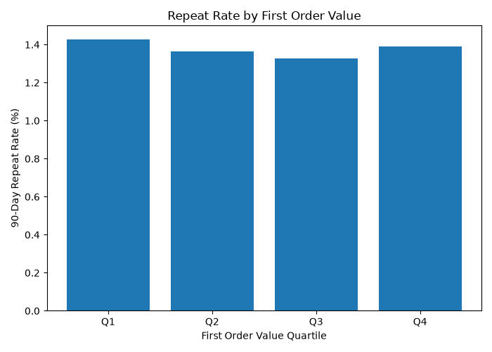

# Analysis Findings

## 1. Primary 90-Day Repeat Purchase Target

모델링 대상 고객:

78,505명

Primary Modeling Target:

첫 승인 주문 이후 1시간을 초과한 시점부터
90일 이내에 추가 승인 주문이 발생했는지 여부

Primary Repeat Customers:

1,082명

Primary Repeat Rate:

1.38%

### Reference Target

첫 승인 주문 직후부터 90일까지의
기존 `repeat_90d` 정의에서는:

- Repeat customers: 1,766명
- Repeat rate: 2.25%

### 해석

초단기 주문을 제외한 Primary Modeling Target은
전체 고객의 1.38%만 Positive Class에 해당한다.

모든 고객을 Non-Repeat로 예측해도
약 98.62%의 Accuracy가 나오므로
Accuracy는 주요 모델 평가 지표로 사용하지 않는다.

모델 평가는 다음 지표를 중심으로 수행하였다.

- PR-AUC
- Precision@K
- Recall@K
- Lift@K

---

## 2. Cohort Stability

Primary Cohort 비교 기간:

2017-01 ~ 2018-05

2016년 Cohort는 관측 고객 수가 매우 적어 Primary 비교에서 제외한다.

2018-06 Cohort는 해당 월 일부 고객만 90일 전체 Outcome Window를 확보할 수 있으므로 제외한다.

### 분석 결과

Primary 기간의 월별 90일 재구매율은 대략 0.92% ~ 1.93% 범위에서 움직였다.

표본 규모가 더 안정적인 2017-02 이후 Cohort의 대부분은 약 0.92% ~ 1.93% 범위에 분포한다.

시간이 지날수록 재구매율이 지속적으로 상승하거나 지속적으로 하락하는 단순한 패턴은 확인되지 않았다.

현재 결과는 기술적 관찰이며, 추가 통계 검증 없이 기간별 구조적 차이라고 해석하지 않는다.

---

## 3. Repeat Timing

Primary Target은 첫 승인 주문 후 1시간을 초과한
추가 주문을 대상으로 한다.

30일 재구매율:

0.72%
(651 / 90,718명)

60일 재구매율:

1.10%
(928 / 84,552명)

90일 재구매율:

1.38%
(1,082 / 78,505명)

### 해석

각 기간의 재구매율은 해당 Outcome Window를 완전히 관찰할 수 있는 고객을 분모로 사용한다.

따라서 30일, 60일, 90일 결과는 동일한 분모를 사용하는 단순 누적 분해값으로 해석하지 않는다.

Primary Target에서 90일 내 재구매한 1,082명의 다음 유효 승인 주문까지 걸린 시간 중앙값은 약 27.63일이다.

이는 초단기 주문을 포함했던 Reference Target의 시간 분포와 크게 다르며, 1시간 제외 정책이 Target의 비즈니스 의미를 실질적으로 변경했음을 보여준다.

---

## 4. Near-Immediate Repeat Orders

첫 구매 후 1시간 이내 추가 주문:

711명
(90일 재구매 고객의 40.26%)

첫 구매 후 24시간 이내 추가 주문:

773명
(43.77%)

첫 구매 후 7일 이내 추가 주문:

921명
(52.15%)

### 해석

90일 재구매 고객의 절반 이상이 첫 구매 이후 7일 이내에 추가 승인 주문을 발생시켰다.

특히 전체 90일 재구매 고객의 40.26%가 1시간 이내에 추가 주문을 발생시켰다.

매우 짧은 주문 간격은 장기적인 고객 유지 행동과 다른 현상을 포함하고 있을 가능성이 있다.

하지만 데이터만으로 분할 주문, 추가 구매, 주문 재시도 등 구체적인 원인을 판별할 수 없다.

이 분석을 근거로 Section 7의 Sensitivity Analysis를 수행했고, repeat_90d_after_1h을 Primary Target으로 확정했다.

---

## 5. First-Purchase Feature Patterns

### 5.1 First Order Value

First Order Value가 관측된 고객:

77,927명

Quartile별 90일 재구매율:

- Q1: 1.43%
- Q2: 1.36%
- Q3: 1.33%
- Q4: 1.39%

### 해석

첫 주문 금액이 커질수록 재구매율도 지속적으로 증가하는 단순한 관계는 나타나지 않았다.

Q1가 가장 높은 재구매율을 보였으며, Q3와 Q2는 Q1과 Q4보다 낮게 나타났다.

따라서 첫 주문 금액만 이용한 단순 Rule은 강한 재구매 우선순위 기준이 아닐 가능성이 있다.

통계 검증 결과, First Order Value Quartile과 재구매 여부 사이에서 통계적으로 유의한 관계는 확인되지 않았다(p = 0.8541, Cramér's V = 0.0032).

따라서 첫 주문 금액만 이용한 단순 Rule의 고객 구분력은 제한적일 가능성이 있다.

---

### 5.2 Basket Size

`first_item_count`가 결측인 고객 578명을 제외하고 77,927명의 고객을 대상으로 첫 주문의 Basket Size와 90일 재구매율을 비교하였다.

Single-Item Order:

- 고객 수: 70,197명
- 90일 재구매 고객: 925명
- 90일 재구매율: 1.32%

Multi-Item Order:

- 고객 수: 7,730명
- 90일 재구매 고객: 149명
- 90일 재구매율: 1.93%

### 해석

첫 주문에서 2개 이상의 Item을 구매한 고객의 90일 재구매율은 1.93%로, 단일 Item 구매 고객의 1.32%보다 높게 나타났다.

두 그룹의 절대 재구매율 차이는 약 0.61%p이며, Multi-Item 고객의 재구매율은 Single-Item 고객보다 기술적으로 약 46% 높은 수준이다.

따라서 첫 구매의 Basket Size는 향후 재구매 가능성을 구분하는 후보 Feature로서 추가 검증 가치가 있는 것으로 보인다.

다만 현재 결과는 기술 통계 수준의 관찰이며, Basket Size가 재구매를 유발한다고 해석할 수 없다.

이후 통계 검증에서도 두 그룹의 차이는 유의하게 나타났다(Z = 4.3649, p = 1.27e-05).

다만 절대 차이는 0.61%p 수준이므로 통계적 유의성과 실제 효과 크기를 구분해 해석한다.

---

### 5.3 Payment Type

Primary Payment Type별 결과:

- credit_card: 1.38% (n=59,297)
- boleto: 1.31% (n=15,900)
- voucher: 1.77% (n=2,481)
- debit_card: 1.57% (n=826)

### 해석

가장 많은 고객이 사용하는 credit_card와 boleto의 재구매율은 매우 비슷하다.

voucher는 1.77%, debit_card는 1.57%를 보였지만 두 집단의 표본 수는 주요 결제 방식보다 작다.

기술 통계에서는 Payment Type별 일부 차이가 관측되었지만, 통계 검증에서는 Payment Type과 재구매 여부 사이의 유의한 관계가 확인되지 않았다(p = 0.3008, Cramér's V = 0.0068).

따라서 Payment Type 단독의 구분력은 매우 제한적인 것으로 판단한다.

---

### 5.4 Product Category

표본 수가 비교적 큰 주요 First-Purchase Category에서도 재구매율 차이가 관측된다.

Examples:

- cama_mesa_banho: 2.06% (n=7,323)
- moveis_decoracao: 1.81% (n=5,147)
- esporte_lazer: 1.81% (n=6,238)
- telefonia: 1.21% (n=3,476)
- eletronicos: 0.82% (n=2,086)
- cool_stuff: 0.65% (n=3,219)

### 해석

Product Category는 통계적으로 유의한 관계를 보였지만 Cramér's V는 0.0362로 작았다.

또한 Category를 포함한 전체 First-Purchase Feature Set으로 구축한 Logistic Regression 역시 Final Test에서 강한 Ranking 성능을 보이지 못했다.

따라서 Category는 재구매 행동과 일정한 연관성이 있지만, 단독 또는 현재 Feature 조합에서 강한 예측력을 제공한다고 해석하지 않는다.

---

### 5.5 Geography

State별 재구매율에도 일부 차이가 관측된다.

하지만 고객 수가 적은 State에서는 재구매율 추정치의 변동성이 매우 크다.

예를 들어 표본 수가 큰 SP와 RJ는 전체 재구매율과 비슷한 수준을 보이는 반면, 일부 중소 규모 State는 상대적으로 높거나 낮은 재구매율을 보인다.

### 해석

Geography는 모델 후보 Feature로 유지한다.

다만 State별 재구매율은 반드시 표본 수와 통계적 불확실성을 함께 고려한다.

표본 수가 매우 작은 State의 높은 재구매율을 독립적인 비즈니스 결과로 해석하지 않는다.

---

## 6. Data Quality Findings

Eligible 고객 78,505명 기준으로 다음 결측이 확인되었다.

First-Order Item 관련 Feature 결측:

578명

First-Order Payment 관련 Feature 결측:

1명

Primary Product Category 결측:

1,877명

### 해석

결측값을 즉시 삭제하거나 평균 및 최빈값으로 임의 대체하지 않는다.

Item 및 Payment 결측은 원천 데이터 레코드 부재에서 발생했음을 확인했으며, 모델링에서는 결측 고객을 일괄 제거하지 않고 Pipeline 내부에서 Missing Indicator 및 대체 정책을 적용한다.

---

## 7. Target Sensitivity

### Reference Target

첫 승인 주문 직후부터 90일까지:

- Eligible customers: 78,505명
- Repeat customers: 1,766명
- Repeat rate: 2.25%

### After 1 Hour

- Repeat customers: 1,082명
- Repeat rate: 1.38%

### After 24 Hours

- Repeat customers: 1,024명
- Repeat rate: 1.30%

### 최종 결정

1시간 이내 주문을 제외하면 Positive 고객 수는 Reference Target 대비 약 38.7% 감소한다.

반면 1시간과 24시간 기준 사이의 차이는 58명, 약 0.08%p에 그쳤다.

이에 따라 본 프로젝트에서는 첫 승인 주문 후 1시간을 초과한 시점부터 90일까지의 추가 승인 주문을 Primary Modeling Target으로 확정하였다.

기존 `repeat_90d`는 Reference Target으로 유지한다.

1시간이라는 경계는 모델 성능을 높이기 위해 사후적으로 선택한 값이 아니라, CRM Retention이라는 비즈니스 질문에 Target의 의미를 맞추기 위해 모델링 이전에 확정한 운영상 기준이다.

---

## 8. Statistical Validation

### Basket Size

Single-Item:

- Repeat Rate: 1.32%
- 95% Wilson CI: 1.24% ~ 1.40%

Multi-Item:

- Repeat Rate: 1.93%
- 95% Wilson CI: 1.64% ~ 2.26%

Absolute Difference:

0.61%p

Relative Risk:

1.463

Two-Proportion Z-Test:

- Z = 4.3649
- p = 1.27e-05

### 해석

Single-Item 고객과 Multi-Item 고객의 90일 재구매율 차이는 통계적으로 유의하게 나타났다.

Multi-Item 고객의 재구매율은 1.93%로, Single-Item 고객의 1.32%보다 약 0.61%p 높다.

상대적으로는 Multi-Item 고객의 재구매율이 약 1.46배 높은 수준이다.

다만 전체 재구매율 자체가 낮기 때문에 절대적인 차이는 0.61%p 수준이다.

따라서 Basket Size는 재구매 가능성을 구분하는 의미 있는 후보 Feature로 유지하되, 이 결과만으로 강한 단독 예측 변수라고 판단하지 않는다.

또한 본 결과는 연관성을 보여주는 것이며 Multi-Item 구매가 재구매를 유발한다는 인과적 의미로 해석하지 않는다.

### First Order Value

Chi-Square:

p = 0.8541

Cramér's V:

0.0032

### 해석

First Order Value Quartile과 재구매 여부 사이에서 통계적으로 유의한 관계는 확인되지 않았다.

Cramér's V도 매우 작아, 첫 주문 금액 자체의 독립적인 구분력은 제한적일 가능성이 있다.

---

### Payment Type

Chi-Square:

p = 0.3008

Cramér's V:

0.0068

### 해석

Primary Payment Type과 재구매 여부 사이에서도 통계적으로 유의한 관계는 확인되지 않았다.

주요 Payment Type별 기술적 차이는 존재하지만 전체적인 연관성은 매우 약한 수준이다.

### Product Category

Analysis Population:

n >= 500 categories

Chi-Square:

p = 2.62e-10

Cramér's V:

0.0362

### 해석

Product Category와 90일 재구매 여부 사이에는 통계적으로 유의한 관계가 관측되었다.

다만 Cramér's V는 0.0362로 작기 때문에 전체적인 연관성의 크기는 강하지 않다.

따라서 Category는 모델 Feature 후보로 유지하지만, Category 하나만으로 고객을 강하게 구분할 수 있다고 해석하지 않는다.

향후 시간 기반 Validation에서 다른 첫 구매 Feature와 함께 사용했을 때 실제 예측 성능에 기여하는지 확인한다.

---

## 9. Baseline Modeling

첫 구매 시점 기준 Time-Based Split을 사용하여 Rule-Based Baseline과 Logistic Regression을 비교하였다.

### Validation

Logistic Regression:

- PR-AUC: 0.0175
- ROC-AUC: 0.5739
- Top 10% Lift: 1.52

동일 CRM Capacity 비교:

- Multi-Item Rule: 43명의 Repeat 고객 포착
- Logistic Regression: 39명 포착

Lift:

- Multi-Item Rule: 1.68
- Logistic Regression: 1.52

### Final Test

Validation 이후 Train과 Validation을 결합한 64,336명의 Development Population으로 최종 Logistic Regression을 재학습하였다.

Development:

- Customers: 64,336
- Repeat Customers: 880
- Repeat Rate: 1.37%

Test:

- Customers: 14,169
- Repeat Customers: 202
- Repeat Rate: 1.43%

Final Logistic Regression:

- PR-AUC: 0.0169
- ROC-AUC: 0.5264
- Top 5% Lift: 1.88
- Top 10% Lift: 1.19
- Top 20% Lift: 1.19

### Same-Capacity Test

동일하게 1,466명을 CRM 대상으로 선정했을 때:

Multi-Item Rule:

- Captured Repeat: 32
- Precision: 2.18%
- Recall: 15.84%
- Lift: 1.53

Final Logistic Regression:

- Captured Repeat: 24
- Precision: 1.64%
- Recall: 11.88%
- Lift: 1.15

### 해석

Validation과 Final Test 모두에서 Multi-Item Rule이 Logistic Regression보다 동일한 CRM 처리 용량에서 더 많은 Repeat 고객을 포착하였다.

특히 Final Test에서는 Rule이 Logistic Regression보다 8명의 Repeat 고객을 추가로 포착하였다.

Final Logistic Regression의 전체적인 Ranking 구분력은 제한적이었지만, Top 5% 고객군에서는 Lift 1.88로 일부 예측 신호가 확인되었다.

그러나 대상 고객을 확대할수록 Lift가 약 1.19까지 감소하였다.

따라서 현재 Feature Set에서는 단순한 Multi-Item Rule이 보다 복잡한 Logistic Regression보다 실제 CRM 우선순위 설정에 더 효과적이었다.

---

## 현재까지의 해석

Primary Target 기준 통계 검증 결과, Basket Size와 Product Category는 90일 재구매 여부와 통계적으로 유의한 관계를 보였다.

특히 Multi-Item 고객은 Single-Item 고객보다 재구매율이 약 0.61%p 높고, 상대 재구매율은 약 1.46배로 나타났다.

Product Category 역시 통계적으로 유의했지만 Cramér's V가 0.0362로 작아 전체적인 연관성의 크기는 약한 수준이다.

반면 First Order Value Quartile과 Primary Payment Type에서는 통계적으로 유의한 관계가 확인되지 않았다.

따라서 이후 모델링에서는 Basket Size와 Product Category를 주요 후보 Feature로 유지하되, 어떤 Feature도 단독으로 강한 예측 변수라고 가정하지 않는다.

최종 Feature의 가치는 시간 기반 Train / Validation / Test와 실제 Ranking 성능을 통해 다시 평가한다.