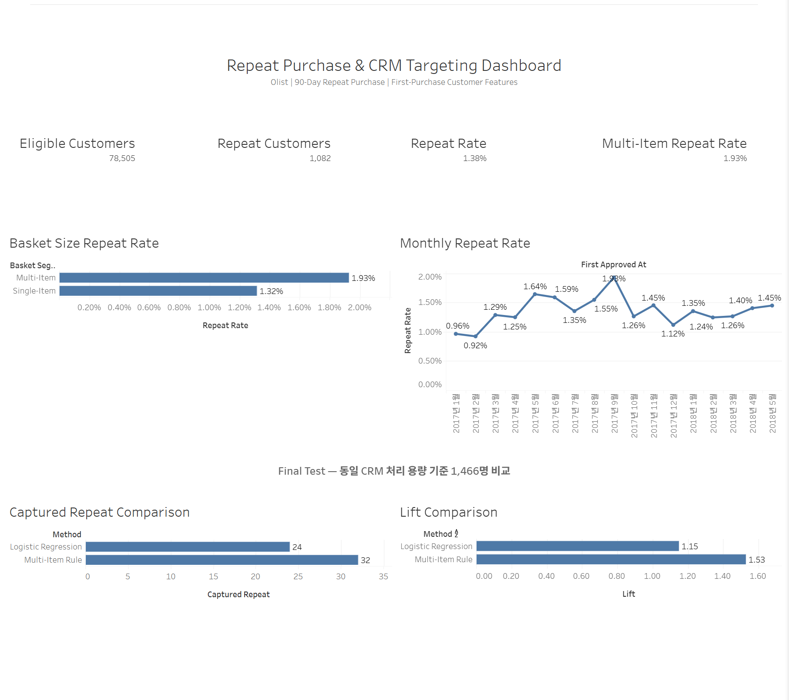

# Tableau 대시보드

## 대시보드

**Olist Repeat Purchase & CRM Targeting Dashboard**

Olist 고객의 첫 구매 정보를 기반으로
90일 재구매 행동과 CRM 고객 우선순위 결과를
탐색할 수 있도록 구성한 Tableau 대시보드입니다.

## 분석 목적

다음 질문에 답할 수 있도록 구성했습니다.

- 90일 Outcome을 관찰할 수 있는 고객은 몇 명인가?
- 90일 재구매 고객과 재구매율은 어느 정도인가?
- 첫 구매 Basket Size에 따라 재구매율이 다른가?
- 첫 구매 Cohort별 재구매율은 어떻게 변화하는가?
- 동일한 CRM 처리 용량에서 Rule과 Logistic Regression 중
  어느 방식이 실제 Repeat 고객을 더 많이 포착했는가?

## 고객 분석 데이터

데이터 원본:

`tableau_customer_repeat_base.csv`

데이터 단위:

`1행 = 1 customer_unique_id`

분석 대상:

90일 Outcome을 완전히 관찰할 수 있는 고객

Primary Target:

`repeat_90d_after_1h`

즉 첫 승인 주문 후 1시간을 초과한 시점부터
90일 이내 추가 승인 주문 발생 여부를 의미합니다.

## 모델 비교 데이터

데이터 원본:

`tableau_model_comparison.csv`

데이터 단위:

`1행 = 1 targeting method`

Final Test에서 동일한 CRM 처리 용량으로
1,466명의 고객을 선정했을 때
Multi-Item Rule과 Logistic Regression을 비교합니다.

## 주요 KPI

- Eligible Customers: 78,505
- Repeat Customers: 1,082
- 90-Day Repeat Rate: 1.38%
- Multi-Item Repeat Rate: 1.93%

## 주요 시각화

- Basket Size Repeat Rate
- Monthly Repeat Rate
- Captured Repeat Comparison
- Lift Comparison

## CRM Targeting 결과

동일한 1,466명의 고객을 선정했을 때:

| 방식 | 포착한 Repeat 고객 | Precision | Recall | Lift |
|---|---:|---:|---:|---:|
| Multi-Item Rule | 32 | 2.18% | 15.84% | 1.53 |
| Logistic Regression | 24 | 1.64% | 11.88% | 1.15 |

현재 First-Purchase Feature Set에서는
동일 운영 용량 기준 Multi-Item Rule이
Logistic Regression보다 Repeat 고객을 더 많이 포착했습니다.

## Dashboard Filter

고객 행동 분석에는 다음 Filter를 사용합니다.

- Customer State
- Primary Category
- Primary Payment Type

Final Test 모델 비교 결과는
고정된 평가 결과이므로
고객 Filter의 영향을 받지 않도록 분리했습니다.

## 검증

- Eligible Customers: PASS
- Repeat Customers: PASS
- Repeat Rate: PASS
- Basket Size Repeat Rate: PASS
- Model Comparison: PASS

## Dashboard 이미지

## Tableau Public

[Tableau Public에서 대시보드 보기](https://public.tableau.com/views/OlistRepeatPurchaseCRMTargetingDashboard/RepeatPurchaseCRMTargetingDashboard?:language=ko-KR&publish=yes&:sid=&:redirect=auth&:display_count=n&:origin=viz_share_link)

## Workbook

`./repeat_purchase_targeting_dashboard.twb`